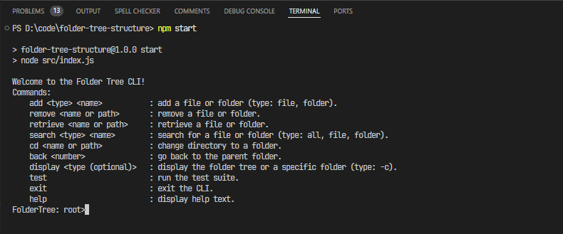

# A folder tree structure project by Nodejs

## The menu of commands



## To start project

### 1. Clone project

```
git clone https://github.com/tblong0210/folder-tree-structure
```

### 3. Open code by vscode

```
cd folder-tree-structure
code .
```

### 2. Start project

```
npm start
```

# Thank you for reviewing this. I look forward to hearing the results from you.
